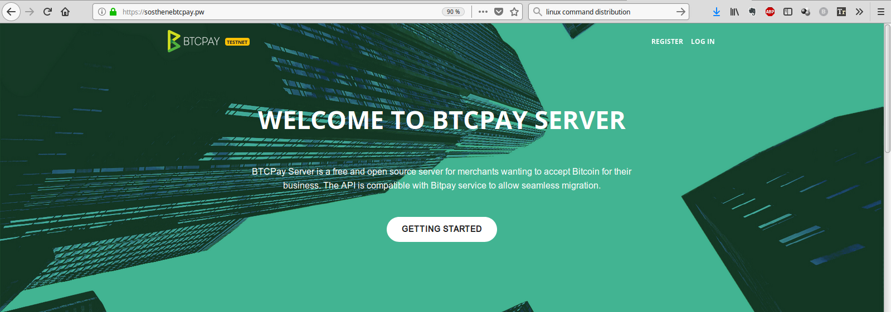
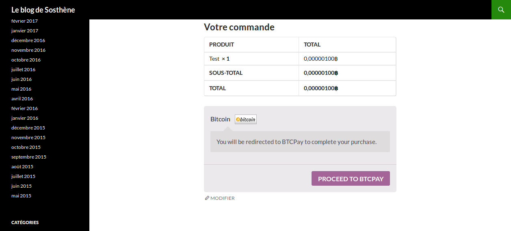
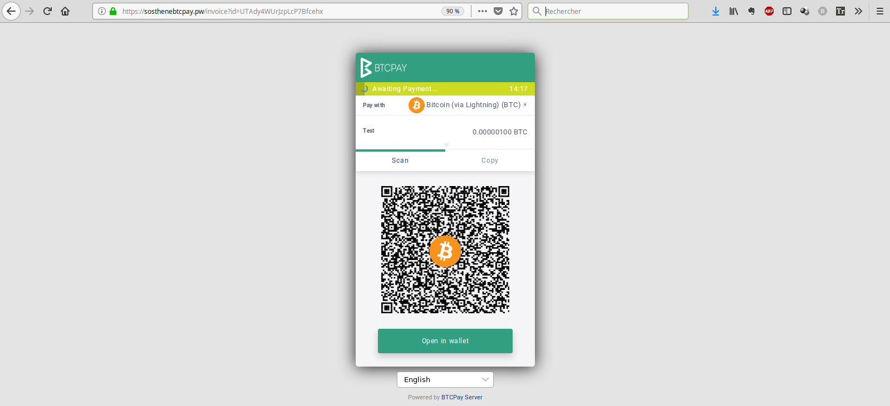

I've discovered BTCPay existence by listening Nicola's talk this summer in Lisbon, and last month I decided to give it a try. Besides understanding how it works, I'd like to use it to enable bitcoins donation through the LN on my personal blog. 

While I have not a lot of experience with other more traditional solutions like Bitpay, Copay etc, I know enough that they suck at best, and can be unethical at worst, so I was particularily attracted by BTCPay's promise, that it allows anyone to be its own payment processor, or be someone's else payment processor, without third party interference. 

I'm even more sensitive to Nicolas' endeavour to make more people independent by running their own full node, which he is doing by embeding a Bitcoin and Lightning node with BTCPay server into a docker to make it as easy to run as a single click.

## The setup

My setup is a bit peculiar: I've been running a Bitcoin and Lightning node on an old computer of mine for some times now, and I thought that I could use it to host BTCPay. 

I thought that I could run it on this little "home server", because it was already here and I kinda like the idea of not relying on anybody, not even a host.

However, this decision brought some (maybe unnecessary) complexity, that I haven't managed to solved completely so far - more on it later.

Here is the details of my setup :
* Intel(R) Core(TM)2 Duo CPU     P8700  @ 2.53GHz
* 4 Gb of RAM
* 500 Gb HDD
* Ubuntu 18.04.1 LTS (Lubuntu)

## What I have so far

I decided to try BTCPay on testnet, since I already run Bitcoin and LND on the same device I thought that it would be too much, and since I'm not sure if I can leverage the datadir of my existing node inside BTCPay's docker it seemed easier to just sync a testnet node first.

While I'm usually using LND, I decided to go with c-lightning for BTCPay, as support for LND seemed quite recent I thought that things will me smoothier with c-lightning, but maybe I was wrong. 

So, that's what I achieved today :
* I run a testnet BTCPay server inside a docker compose on my shitty 2009 laptop :smile:
* my server is accessible to anyone at [sosthenebtcpay.pw](sosthenebtcpay.pw) (or well, at least when it is not down for some reason) to create shop and generate invoices

* I sucessfully paired it with my blog on Wordpress, and can generate invoice for Lightning payment directly from [my blog](sosthene.net).

## What are the issues I already solved

I think that BTCPay is doing a great job overall to make the setup as friendly as possible for newbies. I still encountered some issues and it took me some time to be able to realise even the small achievement that I obtained so far. 

I would say that almost all of my difficulties were either :
* because of my unusual setup
* because of my inexperience

I will list the issues I encountered into one of these two categories, and provide some context and info :
1. problem caused by my setup
* The first issue was because I already run a Lightning instance on the same host, LND and c-lightning were using the same external port (9735), and I had to deal with a port conflict that prevented c-lightning to launch when I ran `. ./btcpay-setup -i`.
	* I had to manually modify the file that contains the setup of the docker compose, which is in `Generated/docker-compose.generated.yml`
	* Here is the [Github issue](https://github.com/btcpayserver/btcpayserver-docker/issues/17) for more information
	* TO DO : update will erase the modification I made to docker-compose.generated file. Nicolas later wrote some instructions about how to save it using [BTCPAYGEN_ADDITIONAL_FRAGMENTS](https://github.com/btcpayserver/btcpayserver-docker#how-can-i-customize-the-generated-docker-compose-file), I tried to do it but it didn't work, not sure why, I need to spend some more time with it.
* Another issue linked to the first one was with the IP address and port in the node info that appears on the invoices I generated. At first, it was `127.0.0.1:9375`, which was obviously wrong. 
	* About the IP, it turned out that I wrote down my host name `sosthenebtcpay.pw` as `127.0.0.1` in my `/etc/hosts` file, probably to make a test at some earlier point, and of course totally forgot about it.
	* Regarding the port, Nicolas made a change in a later commit that solved the issue, I updated and it worked just fine. 
	* Here is the [Github issue](https://github.com/btcpayserver/btcpayserver-docker/issues/17) for more information
* A last issue, that might not be related to BTCPay but still began happening when I started running it and testing invoices, is that recently my server happens to lose suddenly all internet connectivity, and while it immediately get back once, most of the time only reboot can solve the issue. I still have not figured out the cause, but don't be surprise if you can't connect to my BTCPay server those days. 
2. Problems caused by my own inexperience
* I had a hard time to figure out how to connect to my BTCPay server :
	* I didn't understand that I couldn't set the `BTC_HOST` variable as a IP address. So I had to buy a domain name and then lost some more time to figure out how to configure everything (I never dealt with DNS configuration before that, and made some dumb mistakes, that took a while to find out for me because of the time of propagation)
	* I also had an issue with my own server firewall. I denied all incoming connections, including port 80 and 443, and had to allow it again to reach my server from the internet.
* I also experienced issues on the side of my Wordpress. They are not really related to BTCPay, but I found out that I neglected my blog's hosting, that was running on a very old version of PHP and everything was obsolete. I never activated SSL certification, and when I tried I found out that it used an obsolete version of TLS, that [BTCPay wasn't able to communicate with](https://github.com/btcpayserver/woocommerce-plugin/issues/10). After contacting my host to solve the problem everything worked fine.

## What's still to be done

As I said, the next big step would be to go live on mainnet. Besides the unresolved issue that I mentionned before, it still represents some challenge for me :
* I won't download and validate the blockchain again, especially on such an old computer. I need to find a way to leverage my existing blockchain directory for the BTCPay node.
* Same for LND, I already have some channels open, and I'd rather find a way to import my wallet than to start all over again.

While I like the idea of running it on my own hardware, I'm more and more convinced that it would be easier to just buy a VPS somewhere and do the whole sync all over again, and this way I won't mess up with my existing setup. Still need to make up my mind about this.

Even if it wasn't easy, overall I'm really enthusiastic about BTCPay :
* I recycled an obsolete and useless laptop to set up a Bitcoin payment processor that literally anyone can use. I think when everything is ready, it could really be a game changer for Bitcoin payments
* Maybe even more important, it will boost full nodes propagation amongst the "non-initiates".

I think it could be a great tool to educate people about the benefits of being his own sovereign bank, which Bitcoin is all about to begin with.

[Bitcoinshirt](https://bitcoinhackers.org/web/accounts/1672) already made a [great tutorial](https://bitcoinshirt.co/how-to-create-store-accept-bitcoin/) to explain how to set up a very simple and robust ecommerce sites that can receive bitcoins payment with BTCPay.