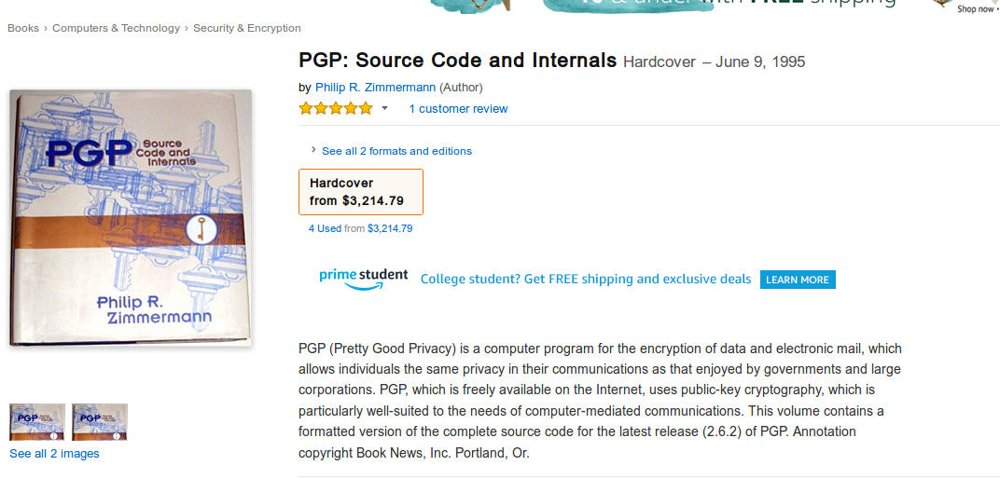
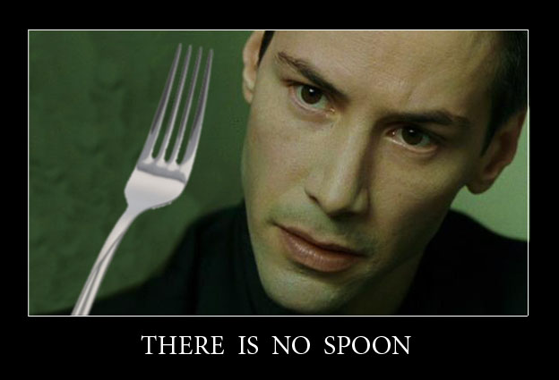

# Bitcoin et bitcoins

Tl ; dr : 

* D’un point de vue factuel, Bitcoin est un **logiciel**, ou autrement dit de l’information, et **rien d’autre** (et surtout pas une monnaie). 
* Bitcoin n’est pas une organisation humaine, et n’a par conséquent pas besoin de gouvernance. Il délimite son propre espace, certes virtuel, mais souverainement gouverné par ses propres règles. 
* Les bitcoins sont des objets virtuels d’un type radicalement nouveau, des informations qui présentent deux caractéristiques propres au monde physique : la **rareté** et la **rivalité**. 
* Bitcoins n’étant ni une organisation, ni un service, ni un produit, nous proposons de le considérer comme une forme de **ressource**. 

Cet article est le deuxième d’une série dont l’objectif est de mettre au clair mes idées sur Bitcoin, et d’en fournir une vision cohérente et accessible pour les néophytes. Ces textes sont aussi en ligne sur [Github](http://www.sosthene.net/finir-blockchain/ "Article 1"), et n’ont pas la prétention d’être définitifs, toute remarque ou proposition est la bienvenue ! 

Nous avons déjà donné une première définition très simple de Bitcoin à travers le problème résolu par sa blockchain : il s’agit d’un moyen d’éliminer simultanément les risques de double-dépense et de contrepartie d’une transaction électronique. 

Voyons aujourd’hui ce qu’_est_ Bitcoin et ce que _sont_ les bitcoins. 

## Ce que Bitcoin n’est pas 

Avant que d’essayer de définir ce qu’est Bitcoin, il semble pertinent d’écarter quelques malentendus courants. Bitcoin n’est donc _pas_ : 
1. une **entreprise** : Bitcoin n’a pas de “PDG” ou de “patron” comme on l’a parfois entendu, il n’a pas de capital social ni d’actionnaires, ni d’employés. Il n’a pas de stratégie marketing, de roadmap, ne donne pas de conférences de presse, et n’a de compte à rendre à personne. 
2. un **service** : Bitcoin ne vous doit rien et n’a pas pour but de satisfaire vos demandes. Si la façon dont il fonctionne ne vous satisfait pas, il est inutile de faire une réclamation ou un procès pour publicité mensongère. Si vous voulez que Bitcoin fasse quelque chose _pour vous_, vous ne pouvez que vous retrousser les manches et le faire vous-mêmes.
3. une **monnaie** : contrairement au dollar ou à l’euro, Bitcoin n’a nulle part cours forcé. Aucun gouvernement n’en impose l’utilisation sous la menace, aucune banque centrale n’en contrôle l’émission ni n’en manipule la quantité à des fins louables mais irréalistes (stimuler l’économie) ou carrément crapuleuse (favoriser les acteurs les mieux placés au détriment de tous les autres). 
4. une **démocratie** : la majorité, que ce soit celle des utilisateurs ou des mineurs, n’a aucun droit d’imposer ses décisions à tous, et n’en a de toute façon pas le pouvoir. L’individu est souverain, personne ne peut forcer quiconque à accepter un nouveau consensus contre son gré. Chacun est libre d’accepter, de refuser ou même de proposer des altérations du protocole, et d’en subir toutes les conséquences. 
5. une **religion** : il y a indéniablement une dimension christique dans le personnage de Satoshi Nakamoto, mais ses quelques écrits épars ne sont brandis comme une vérité révélée que par [une fraction marginale de la communauté](https://www.satoshisvisionconference.com/). Bitcoin ne fait pas appel à la foi, mais aux mathématiques. L’un des dictons des Bitcoiners n’est-il pas “don’t trust, verify” ? 

## Ce qu’est Bitcoin 
Qu’est donc Bitcoin ? Il semble que la seule réponse factuelle à cette question soit un **logiciel**. Préférer définir Bitcoin ainsi plutôt que comme une monnaie a plusieurs implications que nous allons essayer d’explorer. 

Parce que nous faisons tous tourner une multitude de logiciels sur notre ordinateur, nous avons certainement tendance à oublier que tout logiciel n’est avant tout rien d’autre que du texte. 

Le logiciel est une information, on pourrait dire même un discours, et en tant que tel tout individu doit pouvoir l’écrire ou le diffuser au titre de sa liberté d’expression. Cette idée se retrouve également dans la philosophie des _cypherpunks_, une des sources d’inspiration directes de Bitcoin. 

Une anecdote intéressante permet d’illustrer cela. Phil Zimmermann, le créateur du premier logiciel de cryptographie accessible au grand public [_Pretty Good Privacy_](https://en.wikipedia.org/wiki/Pretty_Good_Privacy), a réussi à faire reconnaître que le code qu’il avait écrit était une forme d’expression, et qu’à ce titre le gouvernement ne pouvait l’empêcher de le diffuser, y compris à l’étranger. 

Au début des années 90, la cryptographie était en effet encore considérée comme une arme par le gouvernement américain, qui cherchait à en contrôler la diffusion aussi bien au sein de la société américaine qu’à l’étranger. Afin de contourner l’interdiction, Zimmermann a… édité le code source de PGP sous la forme d’un livre, le plaçant _de facto_ sous la protection du 1er amendement de la Constitution des États-Unis. Le logiciel a ainsi pu être exporté et reproduit sous cette forme en toute légalité.

Une des forces de Bitcoin est qu’il ne s’agit au fond que d’informations. Tout ce que les nœuds s’échangent sur le réseau Bitcoin n’est que cela : du texte. Cela rend une interdiction ou un contrôle réglementaire du réseau très difficile, car contrôler Bitcoin reviendrait à créer un précédent permettant le contrôle de tout logiciel, une pente glissante pour nos démocraties occidentales comme l’explique [Beautyon](https://hackernoon.com/why-america-cant-regulate-bitcoin-8c77cee8d794). 

Autre conséquence, contrairement à ce qui a souvent été dit, Bitcoin est au fond peu dépendant de l’infrastructure d’internet telle qu’elle existe aujourd’hui. En fait, dans un cas extrême il serait tout à fait envisageable de se passer d’ordinateurs pour faire fonctionner le réseau Bitcoin, cela entraînerait des inconvénients évidents mais il n’y a absolument aucune impossibilité à cela. Par ailleurs, il existe aussi des propositions de blockchain simplifiée [_à la main_](https://hackernoon.com/how-to-run-a-blockchain-on-a-deserted-island-with-pen-and-paper-899949ec555b). 

Plus sérieusement, il existe déjà des alternatives à internet comme infrastructure pour le réseau, comme par exemple [un satellite](https://blockstream.com/satellite/) (si ça vous intéresse, voici [un tutorial](https://hackernoon.com/building-your-own-bitcoin-satellite-node-6061d3c93e7) pour installer un nœud connecté par satellite, ce n’est même pas si compliqué !). 

## La blockchain, base de données… de quoi au juste ? 

L'un des malentendus les plus fréquents au sujet de la blockchain concerne la nature des informations que l’on peut y enregistrer. La quantité d’informations inscrite sur une blockchain est contrainte par sa nature distribuée : les mêmes informations sont copiées par chaque utilisateur du réseau. Imaginons que je puisse enregistrer mes photos de vacances sur une blockchain : mes photos doivent alors être téléchargées et sauvegardées par **tous** les participants du réseau, entraînant un gâchis effroyable de bande passante et d’espace disque. 

Il est certes possible d’écrire des données arbitraires dans une transaction Bitcoin, au maximum… 83 octets. Contrairement à ce que des journalistes stupides ont pu écrire, il est **impossible** d’enregistrer et encore moins d’accéder à [des images pédophiles](https://www.theguardian.com/technology/2018/mar/20/child-abuse-imagery-bitcoin-blockchain-illegal-content) sur la blockchain de Bitcoin. 

Ce qu’enregistre la blockchain de Bitcoin, ce sont uniquement des **empreintes cryptographiques** (aussi appelées _hash_). S’il est envisageable de stocker une empreinte cryptographique d’un fichier sur une blockchain, ce qui a effectivement été fait sur celle de Bitcoin, la place pour le faire est extrêmement limitée, et il est de toutes façons impossible à partir de ce fichier de retrouver le fichier d'origine. 

Cette empreinte cryptographique peut être obtenue par différentes fonctions de _hashage_, dont le principe est de générer une séquence en apparence aléatoire, mais en réalité déterministe, de n’importe quel fichier que l’on place en entrant dans cette fonction. 

Ce que la blockchain enregistre, ce ne sont que des _hash_ de données cryptographiques (en général celles de [clés publiques](https://fr.wikipedia.org/wiki/Cryptographie_asym%C3%A9trique)) auxquels sont associés des _unspent transaction output_ (abrégés en UTXO), c’est-à-dire un certain montant en bitcoins. Seul le détenteur de la clé privée correspondante est en mesure de déverrouiller l’UTXO et de l’associer à une autre adresse. La robustesse de Bitcoin tient en grande partie à cette simplicité de fonctionnement. 

## _There is no spoon_ 

Contrairement à l’image trompeuse de la monnaie que nous utilisons dans la vie de tous les jours, lorsque Bob envoie un bitcoin à Alice, ce dernier ne disparaît pas de l’ordinateur de Bob pour aller vers celui d’Alice. Contrairement à [l’histoire populaire](https://www.theguardian.com/technology/2013/nov/27/hard-drive-bitcoin-landfill-site), les bitcoins perdus ne sont pas _dans_ le disque dur égaré. 

L’existence-même des bitcoins est un défi pour l’imagination, car ils ne sont tout simplement… nulle part. Ou plutôt, ils appartiennent à un monde bien distinct du nôtre, où l’espace n’existe pas et le temps s’égrène au rythme des blocs de la blockchain. 

Simples données chiffrées verrouillés cryptographiquement, et par conséquent immatériels, les bitcoins présentent pourtant deux caractéristiques tout à fait propres à notre monde matériel : 
* la **rareté** : le protocole Bitcoin prévoit qu’il ne pourra jamais exister plus de 21 millions d’unités. Si des mineurs essayaient de modifier cette limite, leurs blocs seraient rejetés par tous les nœuds restés fidèles au protocole d’origine, créant _de facto_ un [_fork_](https://en.bitcoin.it/wiki/Hardfork), c’est-à-dire un deuxième réseau parfaitement étanche à celui d’origine. 
* la **rivalité** : le même bitcoin ne peut pas être dépensé simultanément par deux personnes différentes. La possession d’un UTXO (plus précisément, la possession de la clé privée correspondante) sur la blockchain de Bitcoin exclut absolument la possibilité que quiconque d’autre puisse interagir avec le même UTXO. 

Les bitcoins sont donc des objets entièrement nouveaux et absolument inconnus, des informations qui présentent les mêmes caractéristiques que des objets physiques ! 

## Une ressource naturelle et virtuelle 

Partisans et adversaires de Bitcoin tendent aujourd’hui à s’accorder sur le point que les bitcoins sont une monnaie, le débat portant sur sa légitimité en tant que telle. 

Nous pensons que ce débat n’a pas d’objet à partir du moment où Bitcoin est défini comme de l’information, et les bitcoins comme des objets numériques présentant les qualités de rareté et de rivalité. En effet la question de la légitimité  ne se pose que dans le modèle des monnaies _fiat_. Si l’on définit la monnaie comme _monnaie marchandise_, alors aucun bien n’est intrinsèquement monnaie, ce n’est qu’une utilisation possible d’un bien parmi d’autres qui émerge spontanément du marché. 

Bitcoin n’est pas plus intrinsèquement une _monnaie_ que l’or, dont personne ne nie les utilisations autres que monétaires. Peut-être que le mieux à faire est encore de considérer que, comme l’or, l’argent ou le pétrole, les bitcoins sont une **_ressource naturelle_**. 

De même que l’invention du moteur à explosion et des techniques de raffinage à permis de transformer une huile minérale en ressource stratégique majeure, l’invention de Bitcoin a permis d’exploiter l’information d’une façon radicalement nouvelle et de créer une nouvelle ressource inconnue auparavant. 

Peut-être que d’autres utilisations de cette ressource seront découvertes un jour, mais de même que l’or a supplanté tout autre bien dans le rôle d’étalon monétaire, les bitcoins constituent dès aujourd’hui [la monnaie la plus saine](https://www.contrepoints.org/2018/04/20/314393-the-bitcoin-standard-de-saifedean-ammous).
