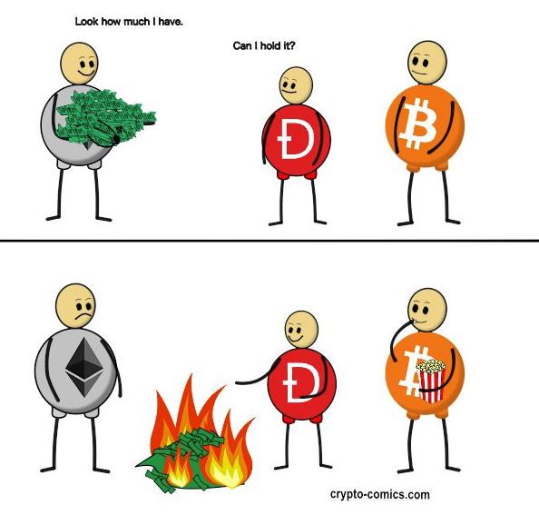
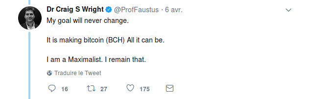

# Survivre à Bitcoin

Bitcoin est un environnement incroyablement hostile, en particulier pour ceux qui le découvrent et n'en maîtrisent ni la technologie, ni les aspects économiques, c'est-à-dire tous les humains sur cette planète à des degrés divers.

Bitcoin est aussi un environnement anarchique et souverain, car il possède une règle et ne reconnaît aucune autorité supérieure à celle-ci. Cette règle est appliquée par chacun des pairs lorsqu'il choisit de faire tourner son propre noeud. 

## Un champ de bataille social

Ces considérations peuvent sembler bien inutilement métaphysiques, mais elles ont pourtant des conséquences très concrètes, à commencer par la difficulté qu'il y a à en modifier les règles. La question de l'immutabilité du consensus entre les pairs est capitale, car c'est elle qui rend Bitcoin révolutionnaire et unique. Elle est aussi problématique, car les évolutions doivent rester possibles, et dans les faits Bitcoin évolue constamment depuis sa genèse.

Contrairement à ce qu'essaient de faire croire les vendeurs de blockchains, cette immutabilité n'a rien de technologique. Le noeud du problème est social : tout changement doit être accepté et mis en oeuvre individuellement par chacun des pairs du réseau. L'humain est à la fois le pilier et le point faible de Bitcoin, et par conséquent la cible de toute attaque un peu sérieuse. 

Laissez-moi reformuler : **VOUS** êtes le point faible, et **VOUS** êtes la cible directe de toutes les attaques ! 

## "Nous sommes tous des escrocs"

Ce qui vaut pour des modifications légitimes est également valable pour les actes disons moralement réprehensibles. Si vous vouliez voler mes bitcoins, que feriez-vous ? Vous pourriez pirater mon ordinateur et vous emparez de mes clés privées. Si vous n’avez pas les compétences requises en informatique, il sera certainement plus simple de m'agresser physiquement pour me contraindre à vous les remettre. 

Vous pourriez faire tout ça, mais le rapport entre le risque et le gain espéré sera très défavorable. « Là où on va, c’est pas pour les teubés », et les voleurs à la petite semaine n’ont pas leur place dans le monde de Bitcoin. 

Si moi je voulais m’emparer de vos bitcoins, vous me les remettriez de votre plein gré, et avec le sourire. Parce que vous ne comprenez rien à Bitcoin et que vous vous en voulez de ne pas en avoir acheté à 10€ quand vous en aviez encore l’occasion, je vous ferai miroiter d’être les premiers sur un investissement qui sera le « nouveau Bitcoin », avec un retour sur investissement de plusieurs milliers de pourcents. Et vous me croirez, pas seulement parce que vous êtes cupide, mais surtout parce que vous n’avez pas encore compris qu’il n’y aura pas de « nouveau Bitcoin », ni qu’aucun investissement ne pourra battre Bitcoin dans un horizon prévisible.

La vérité, c'est que vous êtes seul face à Bitcoin, et que la paranoïa la plus stricte est votre seule chance de salut. Bitstein l'a compris bien plus tôt que moi, et écrivait déjà en 2014 ["nous sommes tous des escrocs"](https://nakamotoinstitute.org/mempool/everyones-a-scammer/). À ce stade précoce de l'histoire de Bitcoin, étant donné son potentiel de croissance délirant comparé aux autres monnaies, le but du jeu pour nous tous devrait être d'en accumuler le plus possible. À moins de miner (ou de les voler), il faudra donc les acheter à quelqu'un de suffisamment stupide pour accepter d'échanger des bitcoins contre la monnaie de singe que sont les euros, les dollars ou le yuan. 

Encore mieux, vous pouvez convaincre quelqu'un que vous pouvez lui donner quelque chose qui aurait soi-disant encore plus de valeur potentielle que les bitcoins, comme un projet d'ICO fumeux ou un shitcoin "qui sera le nouveau Bitcoin".

La première leçon de Bitcoin est donc que vous ne pouvez croire personne, car même si ce que j'écris aujourd'hui vous semble vrai et raisonnable, qui sait si je ne serai pas tenté dans quelques temps de vendre une ICO ou un shitcoin à des pigeons comme vous pour accumuler encore plus de bitcoins ?

## La volonté comme unique rempart

Bien plus que la violence ou le piratage informatique, la manipulation est donc la seule arme réellement efficace pour vous soutirer vos précieux bitcoins. La mauvaise nouvelle, c'est que vous, vous n'avez que votre volonté pour faire face. 

Techniquement, Bcash est un _fork_ de Bitcoin, mais on n'y comprendrait rien en s'arrêtant à ça, mais ce n'est que la moitié de l'histoire, et la moins intéressante avec ça. Bcash est avant tout une attaque _sociale_, une tentative de vous soutirer vos bitcoins. Si ses partisans ne semblent avoir rien d'autre à faire que de crier à tue-tête qu'ils sont le _vrai_ Bitcoin, c'est parce que s'ils ne le faisaient pas cette fiction parasitique qu'est Bcash cesserait instantanément d'exister, et avec elle toute possibilité de vous arnaquer. 

Bcash n'est toutefois qu'un exemple particulièrement frappant de ce type d'escroqueries. Mentir effrontément est une stratégie très rentable dans Bitcoin, particulièrement dans les périodes où les nouveaux arrivants sont nombreux et ne peuvent plus être absorbés par leur communauté locale. Ces nouveaux arrivants peuvent essayer de s'informer bien sûr, mais par où commencer quand il n'existe aucune autorité et aucune source d'informations fiable ? 

Ces néophytes forment une proie rêvée pour les escrocs de tout poil, y compris ceux avec un passif déjà bien chargé qui peuvent sévir bien trop longtemps avant de voir leur crédibilité irrémédiablement compromise. 

## Vademecum

Si vous voulez durer dans le monde de Bitcoin et surtout tous les garder en votre possession, il faudra donc affermir votre volonté pour résister aux pressions parfois très subtiles dont vous serez la cible. Cela nécessite principalement de l'expérience, mais aussi de comprendre pourquoi vous ne devez vous séparez de vos bitcoins sous aucun prétexte et surtout pas pour investir dans autre chose.

S'il est évidemment impossible de reconnaître à coup sûr les escrocs que vous croiserez sur votre chemin, il existe je pense un signe qui ne trompe pas : fuyez quiconque essaie de minimiser votre liberté et votre responsabilité en tant qu'individu, car Bitcoin n'est que ça, [un outil pour étendre votre contrôle et votre pouvoir en tant qu'individu](https://twitter.com/Bob_le_chinois/status/1014470369678372864). Dire le contraire, c'est défendre que **votre** pouvoir doit revenir à quelqu'un d'autre, et vous n'avez aucune raison d'accepter cela.

Si quelqu'un essaie de vous rabaisser à un rôle de consommateur passif d'un réseau de paiement, d'insinuer que c'est trop compliqué pour vous et que vous n'avez de toute façon pas besoin de comprendre, ne vous laissez pas faire et contre-attaquez. 

Soyez sceptiques et doutez de tous et de tout, admettez vos erreurs quand vous en commettez, mais n'oubliez jamais que vous n'avez pas moins de bon sens que les autres, et qu'à la fin vous ne devrez vous fier qu'à lui.
