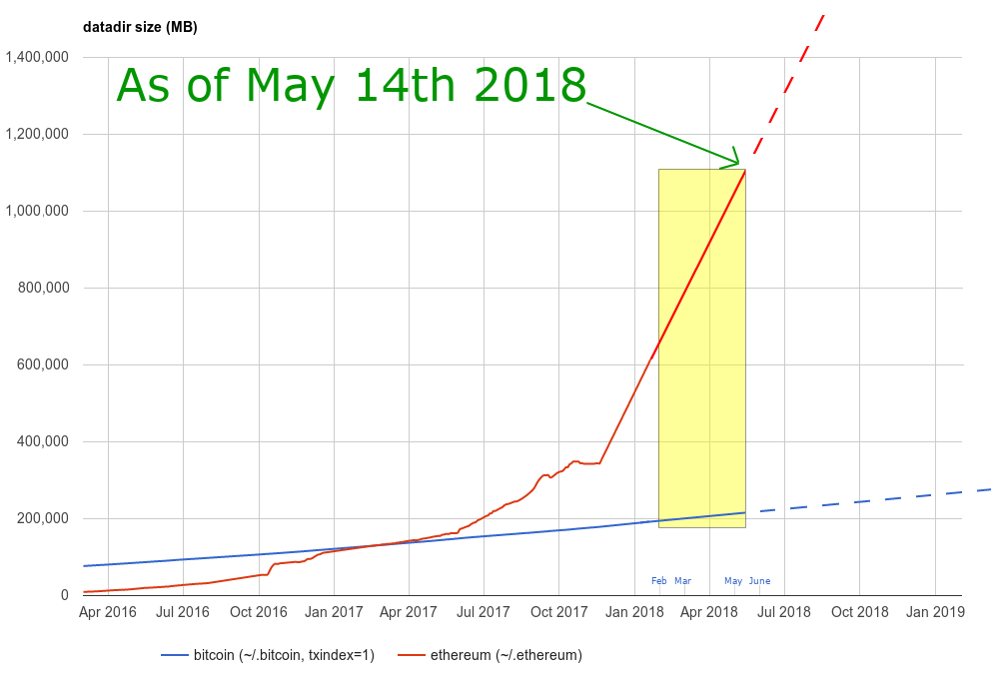

# Apologie des petits blocs

Cet article ne s'adresse pas aux vieux briscards qui ont pris part aux débats de ces dernières années, ils connaissent probablement les arguments développés ici sur le bout des doigts. Non, cet article est destiné avant tout aux nouveaux venus dans le monde de Bitcoin et à ceux qui ne sont pas encore là mais nous rejoindront dans les années à venir. 

L'objet du présent article est de leur proposer un exposé à la fois complet et accessible de la position de ceux que l'on appellera par simplicité les _petits blocistes_. En effet, je n'aime pas spécialement ce terme car la taille des blocs n'a au fond jamais été l'objet du débat, dont on aurait tort de s'arrêter à la dimension purement technique, car ce sont en fait deux visions très différentes de Bitcoin, et surtout deux compréhensions différentes de ce qui en constitue la valeur qui s'y opposent. Un tel article m'a semblé nécessaire pour plusieurs raisons :

*   L'information disponible à ce sujet est éparpillée sur des dizaines d'articles, de posts de blogs, de forums, de tweets, de reddit et de vidéos sur ces 3 dernières années. Tenter de résumer l'essentiel de notre argument dans un texte clair et concis permettra de donner un sens à cette masse d'informations qui risque autrement fort de rester inintelligible.

*   Cela est d'autant plus important que la bulle de 2017 a suscité de façon compréhensible un vif intérêt au-delà des cercles d'amateurs endurcis. On a vu arriver ces derniers mois une nouvelle vague d'utilisateurs, d'investisseurs ou de simples curieux qui, évidemment, ne comprennent rien à ce qui se passe (nous sommes tous passés par là). Malheureusement, les escrocs et les sociopathes de tout poil ont eux aussi rappliqué en masse, surexcités par une telle concentration d'idiots, dont on sait bien qu'il n'est pas difficile de les séparer de leur argent.

*   On pouvait penser que le _hardfork_ de Bcash en août 2017 avait définitivement tranché le débat et que, chacun ayant une chaîne répondant à ses attentes, tout serait bien qui finit bien. Malheureusement, Bcash s'est rapidement mué en instrument d'[agitprop](https://fr.wikipedia.org/wiki/Agitprop) au service d'une petite frange dirigée par un [escroc patenté](https://dankaminsky.com/2016/05/02/validating-satoshi-or-not/) et un [sociopathe narcissique](https://www.youtube.com/watch?v=oCOjCEth6xI) qui poussent depuis quelques temps la fiction que Bcash est le _seul et unique_ Bitcoin. Je n'y avais guère prêté attention avant de constater récemment que des [gens informés et intelligents](https://www.yours.org/content/for-world-adoption--bch-needs-to-solve-two-main-issues-4b03922c0a0d) pouvaient eux aussi tomber dans le panneau. Mais le problème s'étend de toutes façons bien au-delà de Bcash, donc n'en parlons plus pour l'instant.

## Prémisses

Le sujet est complexe et pourrait faire l'objet de volumes entiers. Afin de garder cet article le plus concis possible, j'accepte comme hypothèse les points suivants sans chercher à les argumenter (en partie également car je l'ai déjà fait ailleurs) :

1.  Bitcoin n'est pas un "business", ni une monnaie et encore moins un réseau de paiement, c'est un [logiciel, du code, de l'information](http://www.sosthene.net/bitcoin-bitcoins/), **c'est tout**.

2.  Exécuté par un réseau de pairs, ce code permet de générer, sécuriser et échanger des objets numériques rares et rivaux, communément appelés _bitcoins_.

3.  Les règles du protocole que suivent ces utilisateurs ont été conçus dans un objectif bien précis : créer un ["système pair à pair de cash électronique"](https://bitcoin.org/bitcoin.pdf). Petite mise au point : contrairement à une erreur largement répandue (ignorance que les propagandistes de Bcash exploitent sans vergogne), **_cash_ ne signifie pas "petite monnaie" ou "microtransaction"**. Le cash est simplement une forme d'argent qui a sa valeur _en soi_ et permet le règlement immédiat d'une dette, contrairement à un chèque ou à une carte de crédit qui nécessite l'intervention d'un tiers. Historiquement, le cash, c'est _l'or_, souvenez-vous en la prochaine fois que vous lirez "Bitcoin a trahi la vision de Satoshi, qui était de faire du cash électronique, pas de l'or électronique".

4.  La valeur de Bitcoin réside donc dans sa capacité à **permettre l'émergence d'un système monétaire dont aucun acteur ne peut modifier les règles à son avantage**. Cela est rendu possible par le choix de réaliser un réseau de pairs, c'est-à-dire _d'égaux_, qui contribue à garantir que les _règles du jeu_ restent les mêmes pour tous. Bitcoin n'est en aucun cas une démocratie, ce qui impliquerait qu'une majorité nécessairement définie de façon arbitraire pourrait imposer ses décisions à la minorité. Chaque pair est libre de mettre en œuvre les règles qu'il souhaite et d'en subir toutes les conséquences.

## Trois arguments définitifs en faveur du maintien des petits blocs

1.  Bitcoin impose nécessairement un compromis entre "facilité de transaction" et "facilité de validation", mais la facilité de validation est plus critique et doit être préférée sur la facilité de transaction. Autrement dit, il ne faut **jamais sacrifier une parcelle de facilité de validation pour obtenir davantage de facilité de transaction**.

2.  À l'heure actuelle, il n'y a pas d'alternatives sérieuses à la mise en place d'un nœud personnel pour valider les transactions et s'assurer du respect du protocole par les autres acteurs. Augmenter la taille des blocs augmente les requis techniques, garder les blocs petits abaisse au contraire la barrière à l'entrée à mesure que le hardware à disposition du grand public gagne en performance.

3.  Bitcoin est une opportunité unique, en cas d'échec nous n'aurons probablement pas de deuxième chance de faire croître de façon organique et réellement anarchique un autre système monétaire. Chaque modification doit être entreprise avec une prudence extrême, en particulier quand cela concerne le protocole, et même si cela peut déranger les adeptes du "il faut faire quelque chose", **ne rien faire est souvent une solution tout à fait pertinente quand il s'agit de Bitcoin**.

### Le nécessaire compromis entre nombre de transactions et facilité de les valider

Au cas où vous auriez été exposé à la _blockchain bullshit_ inventée par les consultants pour vendre du POC, il est bon de rappeler l'évidence suivante : la _blockchain_ n'est pas une baguette magique, c'est un dispositif qui remplit un objectif précis, à savoir prévenir la double dépense dans un système décentralisé et ouvert. Ce qui fait de Bitcoin à la fois un système totalement ouvert et totalement sûr, c'est la possibilité donnée à **tous** les utilisateurs d'auditer et de valider **l'intégralité des transactions** jamais effectuées sur le réseau. C'est cette redondance extrême des validations qui rend Bitcoin possible, mais qui impose également des restrictions et des compromis. L'un de ces compromis est entre le nombre de transactions que le réseau peut traiter par seconde (ou _transactions output_) et la facilité avec laquelle ces transactions sont diffusées et vérifiées par les pairs du réseau. 

Contrairement à ce que beaucoup voudraient vous faire croire, il n'y a pas de [repas gratuit](https://en.wikipedia.org/wiki/There_ain%27t_no_such_thing_as_a_free_lunch) : si vous augmentez le nombre de transactions inscrites sur la blockchain en vous contentant de faire des blocs plus gros ou plus rapprochés, vous imposez fatalement à tous les pairs de contrôler et relayer davantage d'informations, ce qui augmente les requis techniques pour opérer un nœud, avec le risque réel qu'une partie du réseau devienne incapable de se synchroniser. **Il ne s'agit pas de simples spéculations théoriques**, c'est ce qui se passe depuis quelques temps sur [Ethereum](https://hackernoon.com/the-ethereum-blockchain-size-has-exceeded-1tb-and-yes-its-an-issue-2b650b5f4f62) par exemple. 

Faisons deux hypothèses extrêmes (et un peu absurdes) pour le besoin de notre argument. Imaginons que la blockchain de Bitcoin s'incrémente de :

1.  1 bloc de 200ko toutes les heures : les requis techniques sont très faibles, ce qui permet de synchroniser la blockchain de Bitcoin sur à peu près n'importe quel appareil disposant d'une connexion internet. En revanche, le nombre de transactions que le réseau pourrait absorber sur une période donnée deviendrait extrêmement limité. Effectuer une transaction sur la blockchain de Bitcoin ne serait rationnel économiquement que dans des cas très particuliers, comme des transferts de fortes sommes d'argent à l'international, ou pour échapper à des tentatives de gel ou de contrôle de capitaux notamment de la part d'un gouvernement.

2.  1 bloc de 1Go toutes les 2 secondes : la blockchain de Bitcoin peut absorber un nombre gigantesque de transactions par seconde, tout le monde l'utilise quotidiennement pour des micropaiements comme pour s'acheter un café par exemple. En revanche, les requis en termes de puissance de calcul et de bande passante pour opérer un nœud sont tellement énormes que seule une poignée d'acteurs (mineurs, grosses entreprises ou gouvernements) peuvent se le permettre.

Dans le premier cas, on obtiendrait certes une situation que beaucoup d'utilisateurs jugeraient aujourd'hui pénible. Beaucoup de cas d'usage ne seraient plus viables et l'adoption massive de Bitcoin par le grand public serait sans doute retardée. En revanche, cette situation extrême préserve **le** cas d'usage, celui qu'aucun autre service ne peut proposer à part Bitcoin : _peer-to-peer electronic cash_. 

Le deuxième cas en revanche est séduisant, n'est-ce pas ? Et pourtant c'est une défaite totale : Bitcoin est mort, et a été remplacé à votre insu par paypal 2.0\. Félicitations, vous avez réinventé le système actuel, et le jour où les 3 ou 4 entreprises en mesure d'entretenir des nœuds décideront de relever la limite de 21 millions de bitcoins ou tout autre modification de protocole à leur avantage, vous n'y pourrez rien, vous n'êtes pas _pair_ du réseau. 

Revenons à la réalité. Les choses sont évidemment beaucoup plus nuancées, mais on peut d'ores et déjà estimer que dans ce dilemme Bitcoin penche déjà un peu trop du côté de la facilité de transaction. Pourquoi ? Le réseau fonctionne aujourd'hui dans des conditions relativement idéales : les infrastructures internet mondiales sont suffisamment intégrées et performantes, aucun État n'a rendu illégal le minage ni la possession d'un nœud Bitcoin. 

En dépit de ces conditions favorables, le minage tend déjà à se centraliser et nombre d'utilisateurs se contentent encore de laisser leurs bitcoins sur une plateforme d'échange ou un client léger. Que se passerait-il si demain l'internet chinois se trouvait isolé du reste du monde ? Si plusieurs États décrétaient une véritable interdiction de Bitcoin, avec saisie de tout ce qui se trouve sur les exchanges en ligne et tentative de localiser et de confisquer les nœuds en opération ? 

Bitcoin a été conçu pour fonctionner dans les conditions les plus difficiles possibles, mais **nous**, sommes-nous vraiment préparés à cela ?

### Pour être un pair sur le réseau Bitcoin, il faut avoir son propre nœud

Être un pair, cela signifie ne dépendre de personne pour être en mesure de valider n'importe quelle transaction ainsi que le respect du consensus par les autres pairs. Aujourd'hui cela n'est possible qu'en opérant son propre nœud. 

Une analogie avec l'or peut être utile pour comprendre pourquoi ce contrôle exercé par l'ensemble des pairs est capital. 

L'or est la meilleure monnaie que l'humanité ait jamais eu... jusqu'à ce qu'il échoue et cesse d'être la base de notre système monétaire il y a un siècle environ. L'or présente certes toutes les qualités de la monnaie par excellence, forte valeur par unité, durabilité, divisibilité etc, mais a aussi des défauts très gênants. 

Les coûts d'une transaction en or sont très élevés en raison de la nécessité de vérifier avec exactitude la qualité de l'or, surtout si l'opération doit être répétée à chaque transaction. Une solution classique à ce problème est de déléguer la vérification à une autorité censé garantir qu'une pièce contient une certaine quantité d'or de tel aloi. Une autre solution un peu plus évoluée consiste à remettre son or en dépôt à une banque, qui nous remet en échange des instruments fiduciaires (lettres de change, chèques, lettres au porteur etc) qui nous permettent d'effectuer nos paiements beaucoup plus simplement. 

En procédant ainsi, les acteurs économiques délèguent en réalité le contrôle sur leur bien au vérificateur : ce sont les fameux risques de contrepartie, ceux que Bitcoin a précisément été inventé pour supprimer. Le vérificateur finit en effet systématiquement par abuser de son pouvoir : les souverains ont **toujours** [dévalué](https://en.wikipedia.org/wiki/Aureus) la monnaie dont ils étaient censé garantir la pureté. Les banques ont **toujours** émis davantage de billets échangeables en or que ce qu'elles possédaient réellement dans leurs coffres. 

 *Sous Dioclétien, l'aureus n'a plus que la moitié de la valeur qu'il avait sous César*

Les crises bancaires du XIXème siècle ont entraîné la création des banques centrales que nous connaissons aujourd'hui, qui sont devenus de gigantesques _single point of failure_ du système de l'étalon-or. 

Après quelques décennies, au début de la 1ère guerre mondiale, les gouvernements européens n'ont plus eu qu'à en saisir les stock d'or pour financer leur effort de guerre. 

Pour éviter d'admettre les proportions dans lesquels la monnaie a été dévaluée durant le conflit, ce qui aurait été politiquement désastreux, il était plus simple de ne pas revenir à l'étalon-or une fois la paix rétablie. 

Ce qui permettra à Bitcoin d'éviter le même destin que l'or, c'est la facilité d'auditer non seulement ses propres transactions, mais aussi toutes celles qui ont eu lieu depuis l'origine du réseau. Opérer un nœud Bitcoin revient en effet à tester les bitcoins échangés dans toutes les transactions jamais effectuées pour garantir qu'il s'agit bien de "vrais" bitcoins, ce qui est infiniment plus puissant et plus efficace que les tests possibles pour l'or. 

Ne pas utiliser son propre nœud revient à s'en remettre à une autorité pour contrôler la qualité des bitcoins que **VOUS** possédez, recréant ainsi la configuration qui a amené à la situation actuelle dans le cas de l'or.

### Nous n'aurons pas de seconde chance

Il existe aujourd'hui plusieurs centaines d'altcoins. L'immense majorité ne sont que de pales copies de Bitcoin, néanmoins certains soutiennent que les altoins pourraient coexister avec Bitcoin, ou même qu'un de ces altcoins pourraient le supplanter à terme. Cela semble improbable pour deux raisons :

*   Une des promesses de Bitcoin est que le nombre de bitcoins en existence ne dépassera jamais 21 millions. Créer des altcoins est une façon de contourner cette limite et de susciter une forme de création monétaire qui dilue à la fois la valeur de chaque bitcoin et aussi celle de chaque altcoin. Ce n'est pas une stratégie viable sur le long terme, et lorsque la bulle _crypto_ éclatera il ne pourra subsister qu'une seule crypto-monnaie dominante, Bitcoin.

*   Bitcoin est la seule occurrence d'une monnaie dont la croissance a été organique et réellement anarchique. **Tous** les altcoins sans aucune exception sont _de facto_ dirigés par une ou plusieurs personnes que tous reconnaissent explicitement ou implicitement comme leur propriétaire légitime. Ces "leaders" constituent un point unique de défaillance, ils peuvent être aisément corrompus ou éliminés. Il y a une forme _d'immaculée conception_ de Bitcoin qu'aucun altcoin ne sera jamais en mesure de reproduire.

Le deuxième point a une autre implication intéressante : une personnalité ne peut devenir et rester influente dans Bitcoin qu'en agissant toujours dans l'intérêt du projet, et perd toute influence aussitôt qu'elle trahit des intentions malveillantes ou simplement égoïstes. S'il est difficile d'imaginer qu'Ethereum puisse survivre sans Vitalik Buterin à sa tête, en revanche personne n'est indispensable pour Bitcoin, et ces dernières années nous ont donné de nombreux exemples de "chutes" de ceux qui ont essayé d'en devenir les _dictateurs (plus ou moins) bienveillants_. Parmi eux, le "dauphin" désigné de Satoshi Nakamoto, Gavin Andresen. 

Cette capacité à renouveler ses "élites" est une caractéristique à notre sens très sous-estimée de Bitcoin, et qu'on ne retrouve dans aucun autre projet. Il est extrêmement douteux qu'aucun altcoin soit un jour en mesure de remplacer, ou même de coexister significativement avec Bitcoin. Si tel est bien le cas, alors nous n'avons qu'une seule chance de créer un système monétaire décentralisé et résistant à toute censure, et nous devons être extrêmement prudents avec toute modification de protocole qui _pourrait_ compromettre la possibilité pour n'importe qui de devenir lui aussi pair du réseau. 

Mais admettons, pour le besoin de l'argument, que Bitcoin pourrait en effet être remplacé par un altcoin qui présenterait les mêmes qualités et fonctionnalités que lui, mais qui lui serait supérieur. Quel mal y a-t-il alors à pécher par excès de prudence dans le développement de Bitcoin ? Même si le développement de Bitcoin venait à être compromis par excès de précautions, nous n'aurions alors qu'à attendre l'émergence d'un "nouveau" Bitcoin. Mais parce que cette dernière hypothèse est très certainement fausse, il est beaucoup moins dangereux de pécher par excès de prudence que l'inverse, et donc de garder les blocs petits.

## Conclusion

Il y a énormément de distractions dans les discussions autour de l'avenir de Bitcoin, ce qui nous empêche de nous poser les vraies questions : qu'est-ce que Bitcoin ? Pourquoi a-t-il autant de valeur ? Quels sont les risques qui pourrait annihiler cette valeur et comment les éviter ? 

Bitcoin est encore à un stade de développement précoce qu'il faut réussir à penser sur plusieurs décennies, beaucoup de choses peuvent se passer mais ce qui est certain, c'est qu'il est difficile d'imaginer un scénario dans lequel Bitcoin échoue _uniquement_ car il ne permet pas d'effectuer des microtransactions _on-chain_. La réintroduction de risques de contrepartie, c'est-à-dire la possibilité pour un tiers de censurer ou d'inverser des transactions, ou encore bien pire, de modifier unilatéralement le protocole, est en revanche un scénario d'échec extrêmement probable et qui devrait tous nous préoccupper. 

Les partisans de Bcash et des gros blocs en général commettent une erreur d'analyse fondamentale : ils pensent que Bitcoin est un réseau de paiement, et évaluent donc sa réussite en le comparant à Visa ou Paypal. Cela est absurde, car pour atteindre les performances en termes de vitesse de transaction qui permettraient à Bitcoin de concurrencer des réseaux de paiement centralisés, il est nécessaire de sacrifier la possibilité d'avoir des validateurs autres que les mineurs. Une fois que ces derniers sont les seuls _pairs_ du réseau, comme dans le cas de l'or, ce n'est qu'une question de temps avant qu'ils n'imposent des changements de protocole. 

Bien sûr, cela se fera avec les meilleures raisons du monde dans l'intérêt général et le pire, c'est que la décision de lever la limite des 21 millions sera accueillie avec indifférence par le public, ou pourrait même rencontrer un certain soutien avec la campagne de communication appropriée. Quand tout le monde le réclamera à corps et à cri, que seuls les mineurs, quelques grosses banques et sans doute le gouvernement possèderont un nœud, qu'est-ce que vous ferez, vous, contre la majorité de vos concitoyens ? On est en démocratie, non ? 

Non ! Tout le sens de Bitcoin est justement de ne pas être une démocratie, de mettre la création monétaire hors de portée du politique. Si ce type de pressions redevient possible, alors Bitcoin n'a plus aucune raison d'être. La meilleure parade que nous ayons pour le moment est de favoriser le déploiement de nœud par le maximum d'individus Cela procurerait les avantages suivants :

*   en cas de tentatives d'interdiction et de confiscation par un ou plusieurs gouvernements, notre meilleure protection est le nombre. Il serait trivial de confisquer leur ordinateur à 50 geeks à l'échelle d'un pays, nettement plus problématique de le faire pour des milliers d'ordinateurs, impossible si il y a un noeud sur chaque ordinateur du pays.

*   l'expérience des hardforks ratés de Bcash ou de S2X nous a enseigné qu'une attaque extrêmement bien organisée et qui avait le soutien des mineurs pouvait reculer face à la résistance des utilisateurs, dans la mesure où ces derniers possédaient leur propre nœud. Cela a constitué un démenti cinglant à la théorie de la "démocratie des mineurs", qui voudrait que seuls les noeuds qui minent aient voix au chapitre, et que les décisions sur l'évolution du protocole se prennent au moyen d'une sorte de processus démocratique où le nombre de voix serait proportionnel au hashrate.

*   cela a également l'avantage de diffuser une culture de responsabilité et d'améliorer la compréhension de Bitcoin et de son fonctionnement.

Ce n'est évidemment pas suffisant, ni infaillible, mais si vous souhaitez que Bitcoin réussisse c'est encore la meilleure chose que vous puissiez faire.

# Références

Je n'ai rien inventé des idées présentes dans cet article. J'ai été particulièrement inspiré par :

*   [Un superbe tweet storm](https://twitter.com/giacomozucco/status/991438132812943369) de Giacomo Zucco, qui a argumenté de façon très convaincante que **si vous supportez Bcash, vous êtes vraiment stupides**.

*   [Un autre](https://twitter.com/giacomozucco/status/1009281116837175296) qui développe l'analogie avec l'or et explique pourquoi Bitcoin est moins vulnérable au risque aux fraudes perpétrées sur l'or (tant que vous avez un noeud bien entendu).

*   [Un plus bref](https://twitter.com/giacomozucco/status/1003305514393063424) pour expliquer que tout ce que vous arriverez à montrer en opposant _cash électronique_ et _or électronique_, c'est que vous ne comprenez le sens ni de l'un, ni de l'autre.

*   StopAndDecrypt a écrit [plusieurs articles](https://hackernoon.com/@StopAndDecrypt) sur ces sujets au cours de l'année passée, dont je recommande chaleureusement la lecture.
