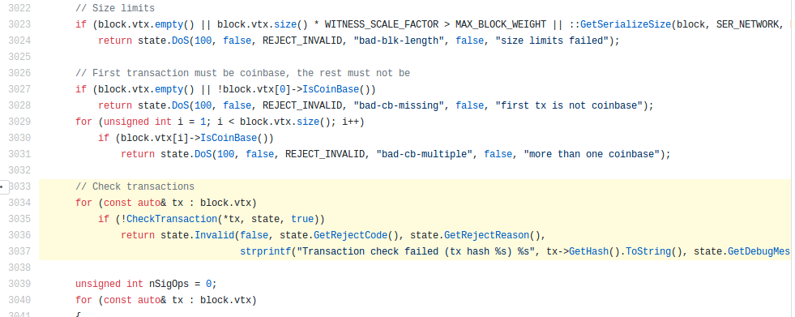
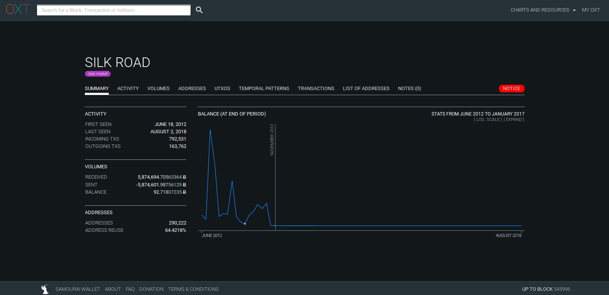
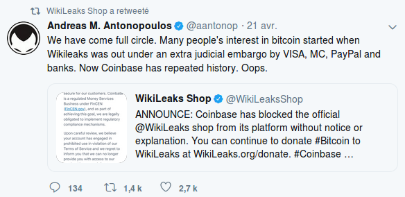

J'ai déjà écrit à plusieurs reprises que vous devriez avoir votre propre nœud Bitcoin, et j'ai déjà donné une ébauche de justification à cet impératif dans mes précédents articles :  
* Il est vital que la vérification du contenu de la blockchain de Bitcoin se fasse d'une façon [décentralisée et ouverte](https://www.sosthene.net/finir-blockchain/), sans quoi le vérificateur réintroduit les risques de contrepartie qu'elle était censée éliminer en premier lieu,  
* d'un point de vue moins altruiste, utiliser un nœud est aujourd'hui le seul moyen de [vérifier soi-même la validité de ses propres transactions](https://www.sosthene.net/apologie-petits-blocs/), et de se mettre à l'abri d'un certain nombre d'attaques.  

Néanmoins la question "pourquoi devrais-je faire tourner mon propre nœud ? Qu'est-ce que j'ai à y gagner ?" revenant fréquemment parmi mes amis, j'ai pensé qu'une explication un peu plus systématique ne serait pas inutile.  

# Qu'est-ce qu'un nœud (_full node_) ? À quoi sert-il ?
Avant de répondre directement à la question, il peut être utile de commencer par rappeler qu'un nœud Bitcoin n'est pas :
* un mineur,
* un portefeuille,
* un nœud d'archives.  

Ou, pour parler en termes de fonctionnalités, un nœud Bitcoin n'est en aucun cas obligé de miner de nouveaux blocs, de contenir une clé privée et de gérer les UTXO associés, ni de servir de sources à d'autres nœuds pour télécharger la blockchain.  

En revanche, un nœud doit au minimum effectuer les tâches suivantes :
1. Télécharger l'intégralité des blocs de l'origine jusqu'à aujourd'hui, y compris donc l'intégralité des transactions qu'ils contiennent,
2. Valider que chacun de ces blocs et chacune des transactions qu'ils contiennent respectent bien le protocole de Bitcoin,
3. Établir une liste des _unspent transaction outputs_ (qu'on pourrait traduire par _produits de transactions passées non encore dépensés_) validée par le nœud lui-même,
4. Renouveler les opérations 1 à 3 pour chaque nouveau bloc miné.  

Voici l'absolue minimum que doit effectuer un client Bitcoin pour pouvoir être qualifié de nœud.  

  
_La partie du code impliqué dans le [bug détecté](https://bitcoincore.org/en/2018/09/20/notice/) le mois dernier. La moindre vulnérabilité dans le code de validation des blocs peut avoir des conséquences catastrophiques, allant de la division du réseau au contournement des règles du protocole._  

En plus de cela, il est encore assez fréquent que les nœuds effectuent les tâches suivantes :
* Validation et relai des transactions non inscrites dans un bloc : le nœud entretient une base de données des transactions non validées qu'il aperçoit sur le réseau, appelée _mempool_. Avantage : cela accélère le relai des transactions sur le réseau, et permet d'éviter qu'elles ne disparaissent si elles ne sont pas inscrites rapidement dans un bloc. Le nœud peut également détecter et bloquer des tentatives de double dépense avant même qu'elles atteignent un mineur (qui les rejetterait de toute façon). Inconvénient : chaque transaction est téléchargée deux fois, une fois en tant que non validée, une fois dans un bloc. C'est pourquoi il existe une option `blocksonly` qui permet de désactiver le _mempool_ et de ne télécharger, valider et relayer que les blocs.
* Mise à disposition de la blockchain pour les nouveaux nœud : un nœud qui contient l'intégralité de la blockchain téléchargeable par d'autres nœuds est souvent appelé _archive_. À ce jour (16/10/2018), la taille du répertoire `blocks` contenant ma blockchain est supérieure à 215 Go. Pour des raisons évidentes d'espaces disques, il est possible _d'élaguer_ (_prune_) la blockchain. Même si cela n'impacte pas les principales tâches de validation, certaines fonctions peuvent nécessiter une blockchain complète, non _prunée_.
* Portefeuille.  

# Pourquoi avoir son propre nœud, en tout égoïsme.
## Indépendance
J'espère vous avoir convaincus que Bitcoin n'a de sens qu'en tant que système de création, de conservation et d'échanges de valeur sûr et sans risques de contrepartie. Mais l'absence de risque de contrepartie n'a rien de magique, et ne signifie au fond qu'une chose : le rôle de validateur que vous déléguiez auparavant à d'autres, c'est vous qui devrez le prendre en charge désormais, et en l'état actuel des choses vous ne pouvez faire ce travail indépendant de vérification qu'en utilisant un nœud.  

À l'heure actuelle et pour l'avenir prévisible, utiliser un nœud est le seul moyen de garantir à 100% que les règles du protocoles n'ont pas été brisées ou contournées. Comme je l'ai écrit par ailleurs : 

> Opérer un nœud Bitcoin revient en effet à tester les bitcoins échangés dans toutes les transactions jamais effectuées pour garantir qu’il s’agit bien de “vrais” bitcoins, ce qui est infiniment plus puissant et plus efficace que les tests possibles pour l’or.  

De même que vous n'accepteriez pas (ou en tout cas ne devriez pas accepter) une pièce d'or sans garantie de sa pureté, **vous ne devriez pas accepter un bitcoin sans avoir pu confirmer sa validité avec un nœud**. Utiliser les alternatives que sont les portefeuille dits "légers" ou, encore pire, les portefeuille en ligne, représente tout simplement un retour à la situation antérieure, à savoir laisser à d'autres le soin de garantir la "pureté" des bitcoins que vous recevez.  

## Sécurité
En plus d'annuler la principale proposition de valeur de Bitcoin, l'utilisation de ces portefeuilles vous expose à des risques supplémentaires. Un portefeuille léger se contente en effet de télécharger les en-tête des blocs et les transactions qui l'intéressent, mais ignore totalement les règles du protocole Bitcoin et sera donc incapable de détecter une transaction invalide dans un la plupart des cas. Autrement dit, on leur ferait croire n'importe quoi (ou presque).  

  
_Lien vers la [présentation](https://youtu.be/UVuUZm4l-ss?t=16156)._

Leur utilisation est particulièrement dangereuse en cas de fork, accidentel ou intentionnel. Un exemple est le [fork accidentel du 4 juillet 2015](https://en.bitcoin.it/wiki/July_2015_chain_forks#Wallet_Advice), durant lequel les utilisateurs d'un portefeuille léger devaient attendre davantage de confirmations pour se protéger d'éventuelles double dépenses tandis que les utilisateurs d'un nœud à jour ne courraient aucun risque. 

En un mot, **un portefeuille léger dépend totalement du nœud auquel il est connecté. Si ce nœud est corrompu ou malicieux, vous n'avez aucun moyen de vous en protéger.**

## Confidentialité
Enfin, comme vous dépendez totalement du nœud de quelqu'un d'autre, cela signifie également que ce "quelqu'un" va disposer de beaucoup d'informations sur vous. En effet, un portefeuille léger, pour obtenir la balance associée à vos adresses, doit transmettre ces dernières à un nœud. Cela signifie que le nœud qui vous fournit ces informations connaît toutes vos adresses, le montant qu'elles contiennent et sait également qu'elles sont associées à la même personne. Pour peu qu'il s'agisse d'un service sur lequel vous devez vous enregistrer avec votre véritable identité comme une plateforme d'échange par exemple, cela signifie qu'un tiers connaît toutes vos adresses, combien elles contiennent et tout ce que vous faites avec.  

Même si vous sortez ensuite vos bitcoins sur un autre portefeuille, le perfectionnement des techniques d'analyse de blockchain fait que vos transactions vont restées transparentes encore un bon moment. 

  
_Avec la blockchain, gardez à l'esprit que vos éventuels méfaits sont enregistrés à la vue de tous pour l'éternité. (source : [oxt.me](https://oxt.me/entity/silk%20road))_

Même s'il existe [quelques techniques](https://github.com/bitcoin/bips/blob/master/bip-0037.mediawiki) qui cherchent à mitiger cet effet, la confidentialité de ces portefeuilles reste assez catastrophique.  

Le seul moyen d'obtenir un début de confidentialité avec Bitcoin est d'utiliser votre propre nœud. Ainsi, vous n'avez besoin d'interroger personne d'autre pour connaître vos adresses et leur balance, et leur association à votre identité, sans être impossible pour un attaquant motivé, est plus difficile.  

Attention néanmoins, avoir son propre nœud est une condition nécessaire, mais généralement insuffisante pour avoir une vraie confidentialité de vos transactions.  

## Si vous êtes un commerçant...
Les raisons invoquées ci-dessus concernent plutôt les particuliers et simples utilisateurs de Bitcoin. Si vous êtes une entreprise, un commerçant, une organisation quelconque, et que vous recevez ou effectuez des paiements, ou même simplement recevez des dons en bitcoins, alors **il est extrêmement dangereux pour vous de faire l'économie d'un nœud**.  

  
_En avril dernier, Coinbase suspend le compte de Wikileaks, et l'ironie de la situation n'échappe pas à Antonopoulos_  

En plus des raisons ci-dessus qui s'appliquent tout autant à vous, vous devez en plus considérer les risques suivants :
* Disponibilité : si le service dont vous dépendez pour recevoir vos paiements ou obtenir vos balances n'est pas disponible pour plusieurs heures, cela peut avoir des conséquences sévères. Or, aucun service centralisé ne peut se vanter d'un taux de disponibilité comparable à celui de Bitcoin. 
* Résistance à la censure : selon votre environnement, cela peut être une considération tout à fait secondaire ou vital. Mais dans tous les cas, gardez à l'esprit que si vous n'avez pas votre propre nœud, **vous êtes littéralement à la merci du service que vous utilisez**, et encore pire de toutes les règlementations à la mords-moi-le-nœud qu'il doit malgré tout respecter, ou carrément de pressions directes que les gouvernements peuvent exercer sur lui. **En breg, cela ne représente absolument aucun amélioration par rapport à la situation que vous avez pu connaître avec les banques.**

## Conclusion
Que vous soyez un quidam ou une entreprise, si vous voulez utiliser Bitcoin pour épargner ou échanger, mais que vous n'êtes pas prêt à utiliser votre propre nœud pour vos transactions, arrêtez-vous et posez-vous la question : avez-vous vraiment besoin de Bitcoin ? Ou du moins, cela est-il suffisamment important pour vous pour que vous soyez prêts à y investir un tout petit peu de temps ?  

Si la réponse est positive, alors ne faites pas l'économie d'un nœud, car il est à peu près certain que vous le regretterez un jour.  

# Les solutions
Bien, maintenant que vous êtes convaincus, vous vous demandez certainement comment faire ?  
* Si vous êtes un individu lambda avec peu de bitcoins et peu de temps et/ou d'intérêt à consacrer à ça : installer simplement Bitcoin Core en suivant ces instructions.
* Si vous êtes un individu moins lambda : vous pouvez suivre ce tuto pour installer un nœud Bitcoin et Lightning sur un vieil ordinateur qui ne vous sert plus.
* Si vous êtes une entreprise ou un marchand : vous pouvez suivre ce [tuto en vidéo](https://youtu.be/NjslXYvp8bk) pour installer un serveur [BTCPay](https://bitcoin.fr/btcpay-tuto/) en 5 min montre en main.